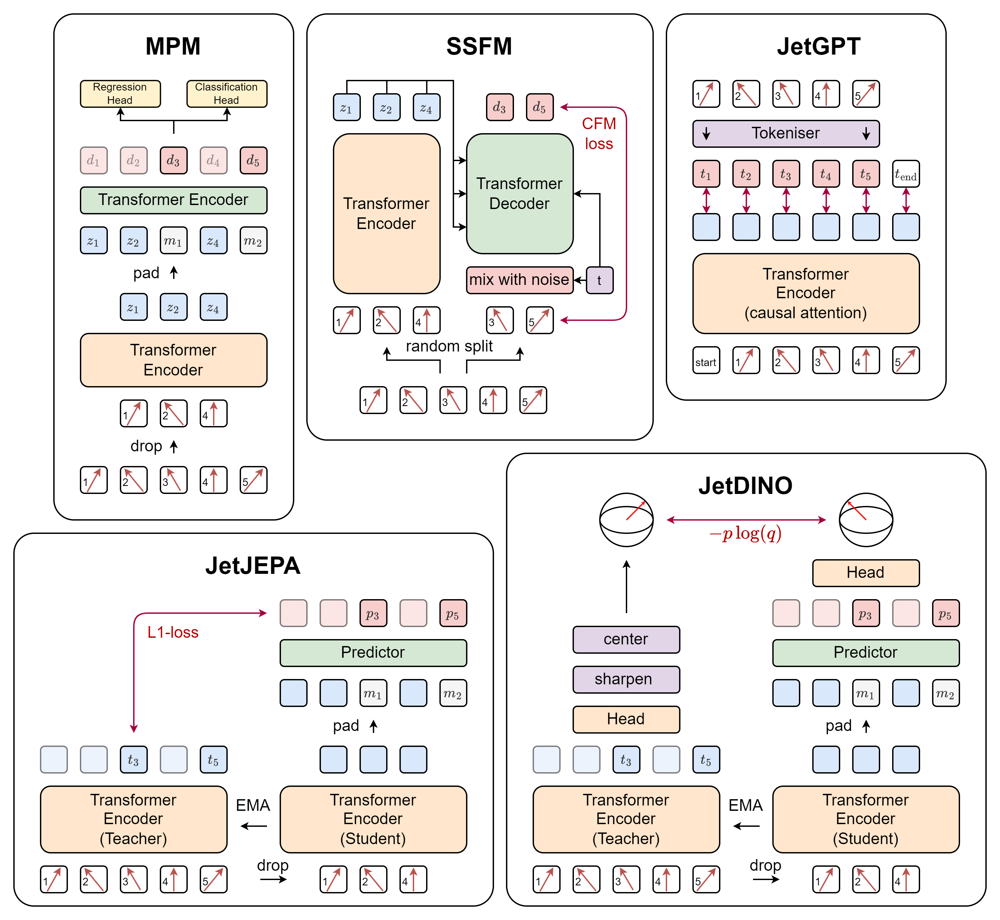
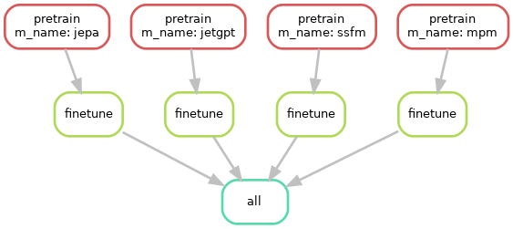

<div align="center">

# JetSSL-Lite

[](https://pytorch.org/)
[](https://lightning.ai/)
[](https://hydra.cc/)
[](https://wandb.ai)

 \

### JetClass Classification Score - Fixed Backbone
24 hours SSL + 2 hours supervised
  
| SSFM    | MPM     | GPT     | DINO    | JEPA    |
|---------|---------|---------|---------|---------|
| 0.82937 | 0.81275 | 0.77454 | 0.61753 | 0.45025 |

</div>

The goal of this project is to test out various self-supervised / unsupervised pretraining strategies for high energy physics jets.
It represents a minimal implementation of the paper [Is Tokenization Needed for Masked Particle Modelling?](https://arxiv.org/html/2409.12589v2).
It is also a stripped-down and reduced version of the [original repo](https://github.com/mattcleigh/jetssl), which still had older code used in testing and development.

This repo uses PyTorch and Lightning to facilitate training and evaluation of the model, Hydra for configuration management, and Weights and Biases for logging.

Additionally, some models require [FlashAttention](https://github.com/Dao-AILab/flash-attention) to operate, which necessitates running on Nvidia Ampere (or later) GPUs.

## Project Structure

```
├── configs              # All configuration files for hydra
│   ├── callbacks
│   ├── datamodule
│   ├── experiment
│   ├── hydra
│   ├── model
│   ├── export.yaml
│   └── train.yaml
├── data               # Scripts for generating the data files
├── docker             # Dockerfile and other docker related files
├── mltools            # mltools submodule
├── plots              # output plots
├── resources          # Preprocessors and discretisors
├── scripts            # All executable scripts other than data setup
├── workflow           # Workflow examples using snakemake
├── pyproject.toml
├── README.md
├── requirements.txt
└── src                # All source code
    ├── callbacks
    ├── data
    └── models
```

## Installation

This project relies on a custom submodule called `mltools` stored [here](https://gitlab.cern.ch/mleigh/mltools/-/tree/master) on CERN GitLab.
This is a collection of useful functions, layers and networks for deep learning developed by the RODEM group at UNIGE.

If you didn't clone the project with the `--recursive` flag you can pull the submodule using:

```
git submodule update --init --recursive
```

### Via Docker / Apptainer

This project is setup to use the CERN GitLab CI/CD to automatically build a Docker image based on the `docker/Dockerfile` and `requirements.txt` when a commit is pushed.
The latest images can be found [here](https://gitlab.cern.ch/rodem/projects/jetssl-lite/container_registry).

### Via Pip

To install the project locally, you can use the `requirements.txt` file to install the necessary packages.
However, installing FlashAttention requires the packages ninja and packaging to already be installed!

```
pip install packaging ninja
pip install -r requirements.txt
```

## Usage

### Dataset setup

The dataset is generated using the `data` scripts.
Two datasets are used, which first have to be manually downloaded using the following links
* [JetClass Dataset](https://zenodo.org/records/6619768)
* Btagging Dataset (coming soon)

Once the files are downloaded, they need to be converted from ROOT to the more usable HDF format using the following scripts:
* `data/make_jetclass.py`
* `data/make_btag.py`

Additionally, the JetClass dataset is huge and must, therefore, be merged into a single HDF file for fast streaming access during training:
* `data/combine_jetclass.py`


### Training

Configuration is done through Hydra, which not only allows one to configure a class, but also choose which class to use via its instantiation method.

The main configuration file that composes training is `train.yaml`.
* This file sets up all the paths to save the network, the trainer and logger.
* It also imports additional yaml files from the other folders:
    * `model`: Chooses which model to train
    * `callbacks`: Chooses which callbacks to use
    * `datamodule`: Chooses which datamodule to use
    * `experiment`: Overwrites any of the config values before composition

#### Training sets

There are two main classes for the datasets: `StreamDataset` and `MapDataset`, which also have corresponding datamodules.
* The `StreamDataset` is used for the JetClass dataset, which is too large to fit into memory and must be streamed from disk.
For speed, the `StreamDataset` `__getitem__` method returns a full batch slice from the HDF file.
One downside is that the dataset is not shuffled between epochs, but this is not too much of an issue due to its size.
* The `MapDataset` is used for the Btagging dataset, which is small enough to fit into memory.
This is a more traditional PyTorch dataset, which can be shuffled between epochs.

### Exporting

If a model has a `predict_step` method, then outputs can be saved using the `scripts/export.py` script.
The `predict_step` method should return a dictionary of tensors with shape `(batch_size, *)`.
These will be stacked and saved as seperate keys in an output HDF file.

### Using Hydra

It is not advisable to directly change any of the set yaml files.
Instead, change the behavior of the run using an experiment file.

For example, the experiment file `example.yaml` contains:
```yaml
# @package _global_

defaults:
  - override /model: ssfm

encoder_config:
  dim: 64
decoder_config:
  dim: 64
```

This would change the model to use the `ssfm` model and set the encoder and decoder dimensions to 64.
It can be loaded via the command line using the following command:
```sh
python scripts/train.py experiment=example
```

Alternatively, specific parameters can be set via the command line:
```sh
python scripts/train.py model=ssfm encoder_config.dim=64 decoder_config.dim=64
```

### Using Snakemake

The `workflow` directory contains a snakemake file that can be used to run an experiment containing multiple steps.
- This is useful for example running the pretraining and then the finetuning command in sequence for many SSL models.
- The current configuration is designed explicitly for the UNIGE HPC cluster and will need to be modified for other systems.
- It uses SLURM as the executor plugin and requires an apptainer image to have been built.
- Snakemake's updates are not backwards compatible, so specific versions are required to run the workflow.

Install the required packages using:
```sh
pip install snakemake-executor-plugin-slurm==0.4.1 snakemake==8.4.1
```

Then run the workflow using:
```sh
snakemake --snakefile workflow/example.smk --workflow-profile workflow
```

To just build the dag and not run the workflow, append the following to the above command:
```sh
... -e dryrun --dag | dot -Tpng > workflow/example.png
```

This creates the following image:



## License

This project is licensed under the MIT License. See the LICENSE file for details.


